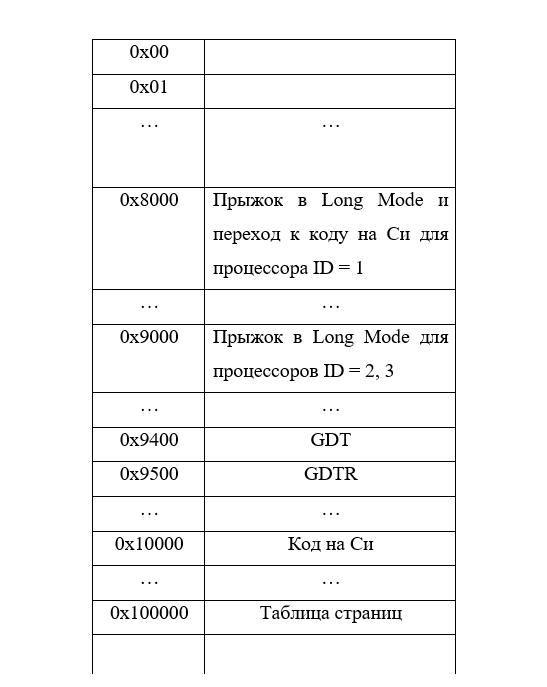

# BootLoader

Данный проект представляет из себя UEFI-приложение, которое инициализирует многопроцессорную систему для выполнения на ней кода, написанного на языке программирования Си.

## Общая структура системы

После запуска компьютера работает только один процессор, на котором запущен код UEFI, - BSP-процессор, поэтому необходимо произвести запуск каждого из процессоров при помощи сигналов INIT-SIPI-SIPI. При этом после второго сигнала SIPI каждый процессор начнет выполнения определенного кода, размещенного в памяти системы.

Запущенный процессор начинает свою работу в 16-битном реальном режиме, однако в таком режиме, хоть и доступны прерывания BIOS, функциональность работы процессора довольна невелика. Поэтому для полноценной работы системы необходимо каждый запущенный процессор перевести в 64-битный режим работы (Long Mode).

### Запуск
1. Запускаются три процессора с ID = 1, 2, 3.
1. Процессор с ID = 1 (BSP-процессор) выполняет код UEFI для отладки системы.
1. Все запущенные процессоры переходят в 64-битный режим работы, выполняя код, написанный на языке Ассемблер. Затем процессор с ID = 1 после перехода в Long Mode выполняет код, написанный на языке Си, а процессоры с ID = 2, 3 после перехода в Long Mode “зацикливаются” и имитируют таким образом работу.

В процессе инициализации системы код, выполняемый запущенными процессорами, а также необходимые атрибуты для корректной работы в 64-битном режиме: таблица GDT и таблицы страниц, - загружаются в память системы:

- ассемблерный код (исходный код в asm/BSPJump.asm) для перехода процессора с ID = 1 в Long Mode и последующего выполнения кода на языке Си расположен по адресу 0x8000
- ассемблерный код (исходный код в asm/APJump.asm) для перехода в 64-битный режим для процессоров с ID = 2, 3 загружен по адресу 0x9000
- таблица GDT расположена по адресу 0x9400
- структура с содержимым регистра GDTR – по адресу 0x9500
- код на языке Си (bsp_c_code), собранный в бинарный файл, размещен по адресу 0x10000
- таблица страниц описывает 4 ГБ адресного пространства и располагается по абсолютному адресу 0x100000

  

Текущая реализация системы является отладочной версией для проверки корректной инициализации многопроцессорной системы, поэтому все три запускаемых процессора при удачном переходе в Long Mode увеличивают значение ячейки по адресу 0x308 памяти на 1 (начальное значение этой ячейки равно 0). Таким образом, можно сделать выводы о запуске всех процессоров по состоянию ячейки памяти по адресу 0x308.

При успешном переходе процессора с ID = 1 на выполнения кода на языке Си происходит бесконечный инкремент ячейки по адресу 0x300 размером 8 байт.

## Сборка и запуск системы

Для сборки, запуска и тестирования системы использовались следующие программные инструменты:
- edk2-stable для сборки UEFI-приложения
- nasm для компиляции кода на Ассемблере
- утилита make для сборки кода на Си
- qemu для виртуализации работы системы
